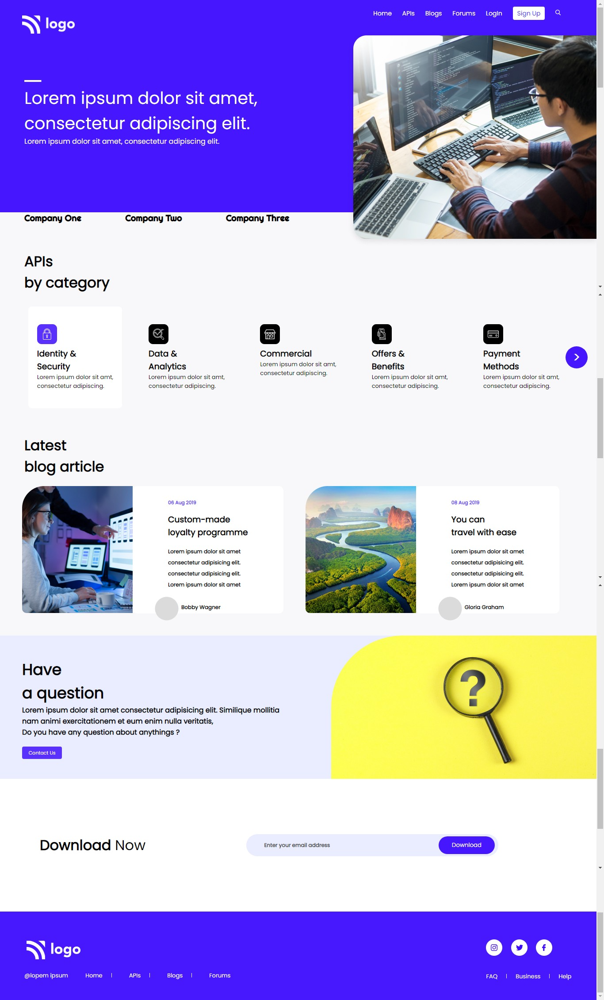

# Project 9 - Developer Landing Page

  

 

[DEPLOYED WEBSITE LINK](https://fsbproject9.netlify.app/)

## What I learned from this Project?

- I learned various flexbox properties.
- I also learned about attribute selectors.
- Learned about cards and alignments.

## Completed the project in **6 hours 30 minutes**.